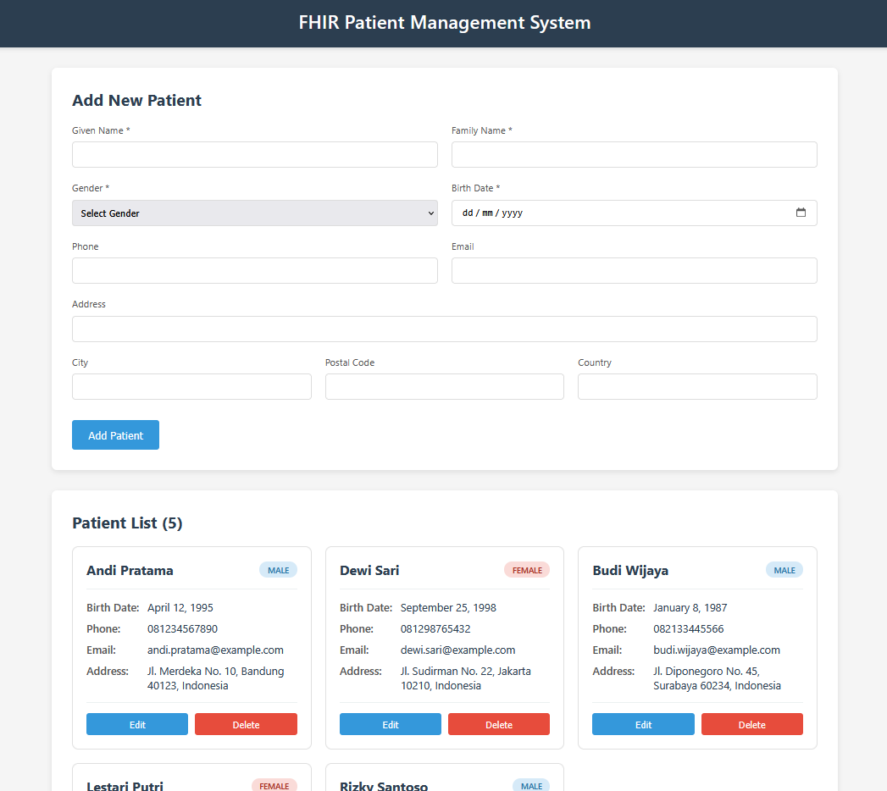

# FHIR Patient Management System

Aplikasi simulasi FHIR (Fast Healthcare Interoperability Resources) untuk manajemen data pasien dengan fitur CRUD lengkap.



## Teknologi yang Digunakan

### Backend
- Node.js + Express.js
- PostgreSQL
- pg (PostgreSQL client)

### Frontend
- React
- Axios (HTTP client)
- CSS3

## Cara Setup dan Menjalankan

### 1. Prerequisites

Pastikan sudah terinstall:
- **Node.js** (v14 atau lebih baru) - [Download](https://nodejs.org/)
- **PostgreSQL** (v12 atau lebih baru) - [Download](https://www.postgresql.org/download/)
- **npm** atau **yarn**

### 2. Clone atau Download Project

```bash
git clone <repository-url>
cd Tugas-SIK
```

### 3. Setup Backend

```bash
# Masuk ke folder backend
cd backend

# Install dependencies
npm install

# Copy file .env.example menjadi .env
copy .env.example .env
# Atau di Linux/Mac: cp .env.example .env

# Edit file .env dan sesuaikan dengan konfigurasi PostgreSQL Anda
# Terutama DB_PASSWORD
```

Contoh isi file `.env`:
```env
PORT=3001

DB_HOST=localhost
DB_PORT=5432
DB_USER=postgres
DB_PASSWORD=password_anda
DB_NAME=fhir_db
```

### 4. Setup Database

Jalankan perintah berikut secara berurutan:

```bash
# Step 1: Generate database fhir_db
npm run db:generate

# Step 2: Migrate schema (buat tabel, index, trigger)
npm run db:migrate

# Step 3: Seed data (isi 5 data pasien contoh)
npm run db:seed
```

### 5. Setup Frontend

Buka terminal baru:

```bash
# Masuk ke folder frontend
cd frontend

# Install dependencies
npm install
```

### 6. Menjalankan Aplikasi

#### Terminal 1 - Backend:

```bash
cd backend
npm run dev
```

Backend akan berjalan di: **http://localhost:3001**

#### Terminal 2 - Frontend:

```bash
cd frontend
npm run dev
```

Frontend akan otomatis terbuka di browser: **http://localhost:3000**

## Fitur Aplikasi

### CRUD Operations:

1. **CREATE** - Tambah pasien baru
   - Isi form dengan data pasien (nama, gender, tanggal lahir, dll)
   - Klik tombol "Add Patient"
   - Data langsung tersimpan ke database

2. **READ** - Lihat daftar pasien
   - Semua pasien ditampilkan dalam bentuk card yang responsive
   - Menampilkan detail lengkap setiap pasien
   - Badge gender dengan warna berbeda
   - Format tanggal otomatis

3. **UPDATE** - Edit data pasien
   - Klik tombol "Edit" pada card pasien
   - Form akan terisi otomatis dengan data pasien (termasuk birth date)
   - Ubah data yang diperlukan
   - Klik "Update Patient" untuk menyimpan
   - Tombol "Cancel" untuk membatalkan

4. **DELETE** - Hapus pasien
   - Klik tombol "Delete" pada card pasien
   - Muncul modal konfirmasi dengan nama pasien
   - Konfirmasi untuk menghapus atau cancel

## API Endpoints

Base URL: `http://localhost:3001`

| Method | Endpoint | Deskripsi |
|--------|----------|-----------|
| GET | `/api/patients` | Ambil semua data pasien |
| GET | `/api/patients/:id` | Ambil data pasien berdasarkan ID |
| POST | `/api/patients` | Buat data pasien baru |
| PUT | `/api/patients/:id` | Update data pasien |
| DELETE | `/api/patients/:id` | Hapus data pasien |

### Contoh Request Body (POST/PUT):

```json
{
  "family_name": "Smith",
  "given_name": "John",
  "gender": "male",
  "birth_date": "1985-06-15",
  "phone": "+1-555-0101",
  "email": "john.smith@email.com",
  "address": "123 Main St",
  "city": "New York",
  "postal_code": "10001",
  "country": "USA"
}
```

## Database Schema

Tabel `patients` dengan field:
- `id` (SERIAL PRIMARY KEY)
- `family_name` (VARCHAR)
- `given_name` (VARCHAR)
- `gender` (VARCHAR) - male, female, other, unknown
- `birth_date` (DATE)
- `phone` (VARCHAR)
- `email` (VARCHAR)
- `address` (TEXT)
- `city` (VARCHAR)
- `postal_code` (VARCHAR)
- `country` (VARCHAR)
- `created_at` (TIMESTAMP)
- `updated_at` (TIMESTAMP)

## Anggota Kelompok

| NIM | Nama |
|-----|------|
| 18322005 | Prajnagastya Adhyatmika |
| 13522027 | Muhammad Althariq Fairuz |
| 13522067 | Randy Verdian |

---

**EB4007 Sistem Informasi Kesehatan**